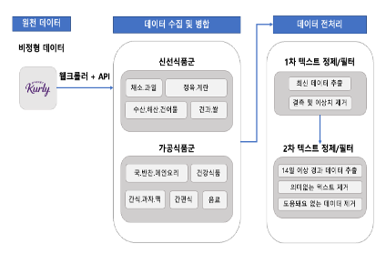
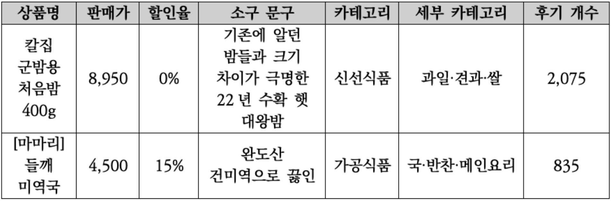
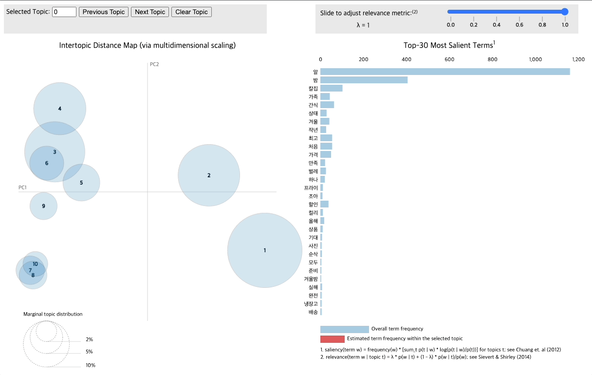

# 온라인 신선식품 전문몰에서의 구매 후기 분석

> 토픽 모델링을 활용한 마켓컬리 리뷰 분석 프로젝트

 

## 1. 개요
---

본 프로젝트에서는 마켓컬리 내 상품에 대한 리뷰 텍스트마이닝을 진행 하였다. 마켓컬리 API를 활용하여 리뷰 400만 건을 수집하고, 유효한 분석을 위해 정보의 유효성과 유용성 측면에서 다음의 단계로 분석 데이터를 정제하는 작업을 진행하였다. 

    

이후, 각 상품 유형(신선식품군, 가공식품군) 별 가장 많은 구매 후기가 달린 상품을 분석 대상으로 선정하여 LDA 토픽 모델링 분석을 실시하였다.

    

 

## 2. 데이터셋
---
### 2.1 구매 리뷰
- 23년 1월 기준, 마켓컬리에서 식품 베스트 항목을 추천순으로 정렬하여 데이터 수집(총 400만 건)
- 데이터 수집 방법: Session Token 값 수집을 위한 크롤러 및 마켓컬리 API 활용(코드 및 설명: [Github](https://github.com/whdvlf94/kurly-crawling/blob/main/kurly_rest_api.py))

 

## 3. LDA 토픽 모델링 결과
---
- `pyLDAvis` 패키지 및 `WordCloud` 를 활용하여 LDA 토픽 모델링 결과 시각화

### 3.1 pyLDAvis

    

### 3.2 WordCloud

    

